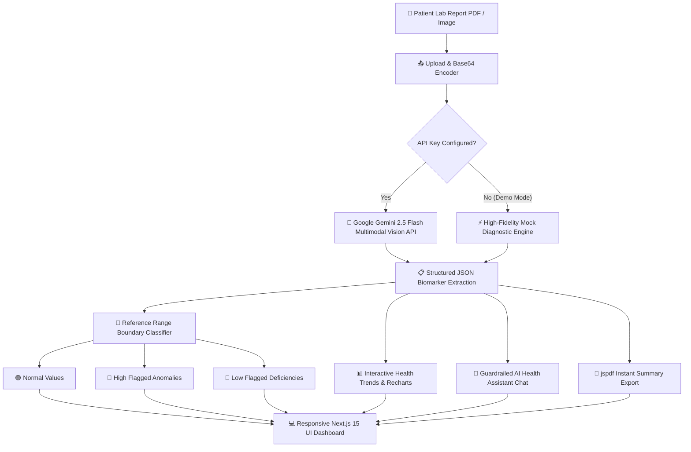

const fs = require('fs');
const path = require('path');

const readmeContent = `# 
 <strong>LabLens</strong> — AI-Powered Medical Report Analyzer

  <em>Transforming complex diagnostic laboratory sheets into clear, actionable, patient-friendly health intelligence.</em>

  
  
  
  
  
  
  

  <a href="#-overview">Overview</a> •
  <a href="#-key-features">Key Features</a> •
  <a href="#-preview--ui-walkthrough">UI Preview</a> •
  <a href="#-system-architecture">Architecture</a> •
  <a href="#-tech-stack">Tech Stack</a> •
  <a href="#-project-structure">Folder Structure</a> •
  <a href="#-getting-started">Quick Start</a> •
  <a href="#-environmental-variables">Environment</a> •
  <a href="#-disclaimer">Disclaimer</a>

---

## 🖼️ Preview & UI Walkthrough

  

  ✨ <i>LabLens interactive dashboard with real-time biometric biomarker classification, visual health risk index, and Gemini-driven diagnostics.</i>

---

## 🌟 Overview

**LabLens** is an intelligent, privacy-conscious medical report analyzer application. Patients frequently receive laboratory test sheets filled with intricate medical jargon, cryptic unit measurements (e.g., \`x10³/µL\`, \`mg/dL\`, \`mIU/L\`), and overwhelming reference ranges. 

**LabLens** solves this by combining **Multimodal Optical Character Recognition (OCR)** powered by **Google Gemini 2.5 Flash** with clinical translation logic. It extracts individual test metrics, evaluates them against diagnostic normal/high/low reference boundaries, provides human-readable explanations ("What it measures" & "What your result means"), and charts longitudinal biometric health trends over time.

---

## 🚀 Key Features

<table>
  <tr>
    <td width="50%">
      <h3>📄 Multimodal Document Ingestion</h3>
      
Seamlessly drag-and-drop or upload medical lab reports in <strong>PDF, PNG, JPG, or JPEG</strong> format (up to 10MB). Handles single and multi-page lab sheets.

    </td>
    <td width="50%">
      <h3>🧠 Gemini 2.5 Flash AI Extraction</h3>
      
Utilizes Google's state-of-the-art vision models to extract laboratory names, test dates, patient metadata, biomarkers, units, and reference limits into structured JSON.

    </td>
  </tr>
  <tr>
    <td width="50%">
      <h3>🔬 Dynamic Range Cross-Evaluation</h3>
      
Automatically flags test values as <kbd>🟢 Normal</kbd>, <kbd>🔴 High</kbd>, <kbd>🔵 Low</kbd>, or <kbd>🟡 Borderline</kbd> based on the lab's printed reference boundaries.

    </td>
    <td width="50%">
      <h3>💡 Jargon-Free Patient Explanations</h3>
      
Translates complex clinical terminology (e.g., Ferritin, MCV, SGPT, eGFR, HbA1c) into clear summaries answering: <em>"What does this measure?"</em> and <em>"What does my result mean?"</em>.

    </td>
  </tr>
  <tr>
    <td width="50%">
      <h3>📈 Longitudinal Health Trends</h3>
      
Visualize chronological changes across repeated lab tests using interactive <strong>Recharts</strong> line graphs to spot health patterns before they become clinical issues.

    </td>
    <td width="50%">
      <h3>🤖 Clinical AI Health Assistant</h3>
      
Ask contextual questions regarding your uploaded reports with conversational memory and strict safety guardrails preventing unverified self-medication.

    </td>
  </tr>
  <tr>
    <td width="50%">
      <h3>📑 One-Click PDF Clinical Summary</h3>
      
Generate clean, exportable PDF summary reports using <code>jspdf</code> to easily share key insights and anomalous markers with your primary care physician.

    </td>
    <td width="50%">
      <h3>⚡ Instant Demo & Production Modes</h3>
      
Ships with built-in high-fidelity <strong>Demo Mode</strong> featuring pre-loaded CBC, Vitamin Panels, and Lipid tests. Plug in API keys anytime for live cloud sync.

    </td>
  </tr>
</table>

---

## 📐 System Architecture

---

## 🛠️ Tech Stack

| Layer | Technologies |
|---|---|
| **Frontend Framework** |    |
| **Styling & Icons** |   |
| **Artificial Intelligence** |   |
| **Charts & Visuals** |   |
| **Backend & Storage** |   |
| **Document Export** |  |

---

## 📁 Project Structure

\`\`\`plaintext
REPORT LEBLENS/
├── public/                     # Static assets, SVG icons, and banner preview
│   ├── lablens-preview.jpg     # Dashboard showcase image
│   ├── favicon.ico             # Application favicon
│   └── *.svg                   # System vector assets
├── src/
│   ├── app/                    # Next.js 15 App Router
│   │   ├── dashboard/          # Protected Patient Portal
│   │   │   ├── analyze/        # Multi-file upload, OCR & extraction pipeline
│   │   │   ├── assistant/      # Context-aware AI Chatbot with medical guardrails
│   │   │   ├── profile/        # Patient profile & personal health records
│   │   │   ├── reports/        # Stored report archives & test details
│   │   │   ├── settings/       # Theme, API Keys, and preferences
│   │   │   ├── trends/         # Historical biomarker visualization charts
│   │   │   ├── layout.tsx      # Dashboard navigation layout with sidebar
│   │   │   └── page.tsx        # Dashboard overview metrics & quick actions
│   │   ├── login/              # Authentication & Guest login portal
│   │   ├── register/           # New patient account registration
│   │   ├── globals.css         # Global Tailwind & design token stylesheet
│   │   ├── layout.tsx          # Root layout with ThemeProvider & AuthProvider
│   │   └── page.tsx            # High-conversion Landing Page & feature showcase
│   ├── components/             # Reusable UI component library
│   │   ├── dashboard/          # Header, Sidebar, Metric Cards, Status Badges
│   │   ├── auth-context.tsx    # Session management & user state provider
│   │   ├── theme-provider.tsx  # Dark / Light theme context provider
│   │   └── LabLensLogo.tsx     # Custom SVG brand mark
│   ├── lib/                    # Core business logic & integrations
│   │   ├── db.ts               # Database abstraction (Supabase + Local Fallback)
│   │   ├── gemini.ts           # Gemini 2.5 Flash Vision OCR & AI prompt pipelines
│   │   ├── pdf.ts              # Client-side PDF generation & parser utilities
│   │   ├── types.ts            # TypeScript interfaces & data contracts
│   │   └── utils.ts            # Tailwind clsx/twMerge helper functions
│   └── services/               # Mock dataset & simulated test generators
│       └── mockData.ts         # High-fidelity CBC, Vitamin, & Lipid mock reports
├── .env.example                # Template for environment configuration
├── package.json                # Project dependencies & npm scripts
├── tsconfig.json               # TypeScript compiler options
└── README.md                   # Project documentation
\`\`\`

---

## ⚡ Getting Started

Follow these steps to run LabLens locally on your machine.

### 1️⃣ Prerequisites
Ensure you have the following installed:
- [Node.js](https://nodejs.org/) (version **18.18.0** or higher recommended)
- [npm](https://www.npmjs.com/) or [pnpm](https://pnpm.io/) or [yarn](https://yarnpkg.com/)

### 2️⃣ Clone Repository
\`\`\`bash
git clone https://github.com/your-username/lablens-report-analyzer.git
cd lablens-report-analyzer
\`\`\`

### 3️⃣ Install Dependencies
\`\`\`bash
npm install
\`\`\`

### 4️⃣ Set Up Environment Variables
Create a \`.env.local\` file in the root directory:
\`\`\`bash
cp .env.example .env.local
\`\`\`

Populate the required credentials (or leave blank to automatically run in **Demo Mode**):
\`\`\`env
# Google Gemini AI Key for Vision OCR & Chatbot
GEMINI_API_KEY=your_gemini_api_key_here

# (Optional) Supabase Database & Auth Configuration
NEXT_PUBLIC_SUPABASE_URL=your_supabase_project_url
NEXT_PUBLIC_SUPABASE_ANON_KEY=your_supabase_anon_key
\`\`\`

### 5️⃣ Launch Development Server
\`\`\`bash
npm run dev
\`\`\`

Open [http://localhost:3000](http://localhost:3000) in your browser to view LabLens!

---

## 🧪 Sample Demonstration Reports

LabLens includes comprehensive mock datasets so you can test the system immediately without requiring an active Gemini API key:

| Report Type | Key Biomarkers Included | Range Indicators Tested |
|---|---|---|
| **🩸 Complete Blood Count (CBC)** | Hemoglobin, RBC, WBC, Platelets, Hematocrit, MCV, MCH | High, Low, & Normal |
| **☀️ Vitamin & Mineral Panel** | Vitamin D (25-OH), Vitamin B12, Serum Iron, Ferritin | Low Deficiencies & Normal |
| **🫀 Lipid & Metabolic Panel** | Total Cholesterol, HDL, LDL, Triglycerides, Fasting Blood Glucose | High Risk & Borderline |

---

## 🛡️ Security & Privacy Guardrails

- 🔒 **No PHI Retention in Demo Mode:** All uploads in demo mode execute purely in browser memory without sending patient medical records to third parties.
- 🩺 **Strict AI Medical Guardrails:** The AI prompt design enforces safety disclaimers: it strictly acts as an educational translator, explicitly refusing to write drug prescriptions or diagnose fatal conditions.
- 🔑 **Environment Key Isolation:** Server Actions ensure third-party API credentials (`GEMINI_API_KEY`) are never exposed to the client bundle.

---

## ⚠️ Medical Disclaimer

> [!IMPORTANT]
> **LabLens is designed for educational and informational purposes only.**  
> The data analysis, explanations, and insights generated by this application do **not** constitute medical advice, clinical diagnoses, or treatment plans. Always consult a qualified healthcare professional or licensed physician regarding any medical conditions, abnormal laboratory results, or therapeutic questions.

---

## 🤝 Contributing

Contributions, issues, and feature requests are welcome!

1. Fork the Project
2. Create your Feature Branch (\`git checkout -b feature/AmazingFeature\`)
3. Commit your Changes (\`git commit -m 'Add some AmazingFeature'\`)
4. Push to the Branch (\`git push origin feature/AmazingFeature\`)
5. Open a Pull Request

---

## 📜 License

Distributed under the **MIT License**. See \`LICENSE\` for more information.

  Built with ❤️ for accessible healthcare and intuitive medical literacy.

`;

const targetPath = 'd:/PROJECTS/REPORT LEBLENS/README.md';
fs.writeFileSync(targetPath, readmeContent, 'utf8');
console.log('README.md written successfully to ' + targetPath);
`;

const scriptPath = 'C:/Users/dhruv/.gemini/antigravity-ide/brain/8a89d46a-551e-4601-a0db-656b8845c24f/scratch/write_readme.js';
fs.mkdirSync(path.dirname(scriptPath), { recursive: true });
fs.writeFileSync(scriptPath, readmeContent, 'utf8');
console.log('Scratch script written successfully');
